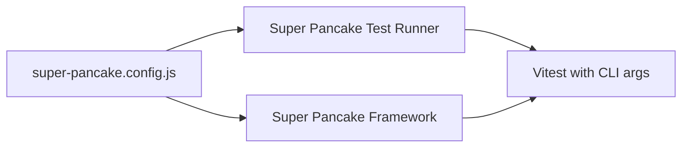

# 🥞 Super Pancake Automation

[](https://badge.fury.io/js/super-pancake-automation)
[](https://opensource.org/licenses/MIT)
[](https://nodejs.org/)
[](https://chromedevtools.github.io/devtools-protocol/)

A **lightweight DOM-based UI automation framework** supporting both **Chrome** and **Firefox** browsers. Super Pancake provides a simple, powerful API for browser automation, testing, and reporting with a beautiful web UI and **live test execution** monitoring.

## 🚀 Quick Start

[//]: # ()
[//]: # (### Install Globally)

[//]: # (```bash)

[//]: # (npm install -g super-pancake-automation)

[//]: # (```)

### Quick Init (Recommended)
```bash
npx super-pancake-automation@latest init my-project
# or
super-pancake-init my-project
```

This creates a complete project with:
- ✅ **Multi-browser support** (Chrome & Firefox)
- ✅ **Automatic screenshot capture** on test failures
- ✅ **Live test execution** monitoring with WebSocket streaming
- ✅ **HTML test reporting** with modern UI
- ✅ Sample test files with comprehensive guides
- ✅ Sensible default configuration
- ✅ Ready to run immediately

### Advanced Setup (Interactive)
```bash
super-pancake-setup
```

This runs an interactive setup wizard with advanced options:
- ✅ Custom configuration (headless/headed, screenshots, reports)
- 📸 Failure screenshot capture
- 📊 HTML test reporting
- 🎥 Video recording (optional)
- 🔍 Network and console logging
- ⚡ Performance tuning options

### Generate Sample Tests (Simple)
```bash
super-pancake-generate
```

This creates basic sample test files in your `tests/` directory.

### Add to Existing Project
```bash
npm install super-pancake-automation
```

### Basic Usage

#### **Interactive UI (Recommended)**
```bash
# Launch web-based test runner with live monitoring
super-pancake-ui
```

#### **Command Line**
```bash
# Run all tests using Super Pancake configuration
npm test

# Run specific test file with Super Pancake settings
node scripts/super-pancake-test.js tests/examples/sample.test.js

# Run with visible browser
HEADED=true npm test

# Run Firefox tests
SUPER_PANCAKE_BROWSER=firefox npm test

# Direct Vitest for watch mode
npx vitest watch tests/examples/
```

#### **Generate Reports**
```bash
# Generate HTML report after tests
npm run report:generate

# Open report in browser
npm run report:test
```

## 📱 Interactive Test Runner UI

Launch the beautiful web interface to run tests visually:

```bash
npx super-pancake-ui
```


### UI Features:
- ✅ **Test Selection**: Choose which tests to run
- 📊 **Real-time Logs**: Watch test execution live with WebSocket streaming
- 🎯 **Individual Test Control**: Run specific test cases
- 🔄 **Auto-refresh**: Automatic test discovery
- 📱 **Responsive Design**: Works on desktop and mobile
- 🦊 **Multi-browser Support**: Switch between Chrome and Firefox
- 🔴 **Live Test Execution**: Real-time progress indicators and console streaming

## 📊 Beautiful HTML Reports

After running tests, view comprehensive reports:

```bash
# Reports are auto-generated after test runs
open automationTestReport.html
```


### Report Features:
- 📈 **Test Statistics**: Pass/fail/skipped counts with charts
- 📸 **Screenshots**: Automatic capture on failures with modal preview
- 🕐 **Timestamps**: Detailed timing information
- 📝 **Error Details**: Stack traces and error messages
- 🎨 **Professional Design**: Clean, modern interface
- 🦊 **Multi-browser Results**: Chrome and Firefox test results
- 📊 **Individual Test Logs**: Comprehensive console output for each test

## 🛠️ Installation & Setup

### Global Installation
```bash
npm install -g super-pancake-automation
```

### Project Installation
```bash
npm install super-pancake-automation --save-dev
```

### Generate Sample Tests
```bash
npx super-pancake-generate
```

## 🎯 Available Commands

### Project Setup
```bash
npm init super-pancake@latest my-project    # Create new project
npx super-pancake --version                # Check version
npx super-pancake --help                   # Show help
```

### Command Reference
| Command | Description | Example |
|---------|-------------|---------|
| `super-pancake-ui` | Launch interactive test runner | `npx super-pancake-ui` |
| `super-pancake-server` | Start UI server only | `npx super-pancake-server` |
| `super-pancake-run` | Run tests with formatted output | `npx super-pancake-run` |
| `super-pancake-generate` | Generate sample test files | `npx super-pancake-generate` |
| `super-pancake` | Main CLI with help/version | `npx super-pancake --version` |
| `domtest` | Basic CLI test runner (legacy) | `npx domtest --url=https://example.com` |

### Live Test Monitoring
```bash
# Live monitoring is now integrated into the main UI
super-pancake-ui

# Click the "Live Mode" button in the interface for real-time monitoring
# Access at http://localhost:3000 and toggle Live Mode ON
```

## 💻 Command Line Usage

### 🚀 Quick Test Execution

#### **Run Single Test File**
```bash
# Using Super Pancake test runner (recommended)
node scripts/super-pancake-test.js tests/api/sample-api.test.js

# With specific browser
SUPER_PANCAKE_BROWSER=chrome node scripts/super-pancake-test.js tests/ui-runner/ui-runner.test.js
SUPER_PANCAKE_BROWSER=firefox node scripts/super-pancake-test.js tests/firefox/firefox-browser.test.js

# Or use npm scripts
npm run test:integration  # Runs tests/integration/
npm run test:examples     # Runs tests/examples/
```

#### **Run Multiple Test Files**
```bash
# Run all tests in a directory
npx vitest run tests/integration/

# Run specific test pattern
npx vitest run tests/**/ui-*.test.js

# Run all API tests
npx vitest run tests/api/
```

### 🎯 Headed vs Headless Mode

#### **Headless Mode (Default)**
```bash
# Headless execution (browser runs in background)
npx vitest run tests/npm-package/npm-package-firefox.test.js

# Explicit headless mode
HEADED=false npx vitest run tests/ui-runner/ui-runner.test.js
SUPER_PANCAKE_HEADLESS=true npx vitest run tests/firefox/firefox-browser.test.js
```

#### **Headed Mode (Visible Browser)**
```bash
# Show browser window during test execution
HEADED=true npx vitest run tests/examples/sample.test.js

# Alternative syntax
SUPER_PANCAKE_HEADLESS=false npx vitest run tests/integration/end-to-end.test.js
```

### 🦊 Multi-Browser Testing

#### **Chrome Browser (Default)**
```bash
# Default Chrome execution
npx vitest run tests/unit/core-functions.test.js

# Explicit Chrome
SUPER_PANCAKE_BROWSER=chrome npx vitest run tests/reporter/html-reporter.test.js
```

#### **Firefox Browser**
```bash
# Firefox execution
SUPER_PANCAKE_BROWSER=firefox npx vitest run tests/npm-package/npm-package-firefox.test.js

# Firefox in headed mode
SUPER_PANCAKE_BROWSER=firefox HEADED=true npx vitest run tests/firefox/firefox-browser.test.js
```

### 📁 Directory & Pattern Testing

#### **Run Entire Test Suites**
```bash
# All integration tests
npx vitest run tests/integration/

# All unit tests
npx vitest run tests/unit/

# All Firefox-specific tests
npx vitest run tests/firefox/

# All NPM package tests
npx vitest run tests/npm-package/
```

#### **Pattern-Based Testing**
```bash
# All test files ending with specific pattern
npx vitest run tests/**/*-api.test.js

# All UI tests across directories
npx vitest run tests/**/ui-*.test.js

# All reporter tests
npx vitest run tests/**/reporter*.test.js

# All browser tests
npx vitest run tests/**/*browser*.test.js
```

### 🔧 Advanced Command Options

#### **Test Selection with Filters**
```bash
# Run specific test by name pattern
npx vitest run tests/ui-runner/ui-runner.test.js -t "should start UI runner"

# Run tests matching description
npx vitest run tests/integration/ -t "end-to-end"

# Skip specific tests
npx vitest run tests/unit/ --reporter=verbose --exclude="**/slow-*"
```

#### **Watch Mode for Development**
```bash
# Watch single test file for changes
npx vitest watch tests/examples/sample.test.js

# Watch entire directory
npx vitest watch tests/integration/

# Watch with browser visible
HEADED=true npx vitest watch tests/ui-runner/ui-runner.test.js
```

#### **Parallel vs Sequential Execution**
```bash
# Sequential execution (recommended for browser tests)
npx vitest run tests/firefox/ --reporter=verbose --threads=false

# Parallel execution (for unit tests)
npx vitest run tests/unit/ --threads=true

# Custom thread count
npx vitest run tests/integration/ --threads=2
```

### 📊 Reporting & Output

#### **Generate HTML Reports**
```bash
# Run tests and generate HTML report
npx vitest run tests/npm-package/ && npm run report:generate

# Clean and fresh report
npm run report:fresh

# Generate report for specific test suite
npx vitest run tests/firefox/ --reporter=json --outputFile=test-results.json
npm run report:generate
```

#### **Verbose Output**
```bash
# Detailed test output
npx vitest run tests/integration/ --reporter=verbose

# JSON output for processing
npx vitest run tests/api/ --reporter=json

# Multiple reporters
npx vitest run tests/unit/ --reporter=verbose --reporter=json --outputFile=results.json
```

### 🔍 Debug & Development

#### **Debug Mode**
```bash
# Debug with visible browser and detailed logs
DEBUG=true HEADED=true npx vitest run tests/examples/sample.test.js

# Debug specific browser
DEBUG=true SUPER_PANCAKE_BROWSER=firefox HEADED=true npx vitest run tests/firefox/
```

#### **Environment-Specific Testing**
```bash
# Test with specific environment variables
NODE_ENV=development npx vitest run tests/integration/

# Custom configuration
SUPER_PANCAKE_TIMEOUT=60000 npx vitest run tests/npm-package/

# Memory optimization for large test suites
NODE_OPTIONS="--max-old-space-size=4096" npx vitest run tests/
```

### 🧹 Cleanup & Maintenance

#### **Clean Test Results**
```bash
# Clean all reports and screenshots
npm run clean:all

# Clean only HTML reports
npm run clean:reports

# Clean only screenshots
npm run screenshots:clean

# Clean test data
npm run clean:data
```

### 📋 Complete Examples

#### **Development Workflow**
```bash
# 1. Run tests in watch mode with browser visible
HEADED=true npx vitest watch tests/examples/

# 2. Run full test suite
npx vitest run tests/integration/

# 3. Generate and view report
npm run report:test
```

#### **CI/CD Pipeline**
```bash
# 1. Clean previous results
npm run clean:all

# 2. Run all tests in headless mode
npx vitest run tests/ --reporter=json --outputFile=test-results.json

# 3. Generate HTML report
npm run report:generate

# 4. Archive results
tar -czf test-results.tar.gz automationTestReport.html screenshots/
```

#### **Cross-Browser Testing**
```bash
# Chrome tests
SUPER_PANCAKE_BROWSER=chrome npx vitest run tests/npm-package/

# Firefox tests  
SUPER_PANCAKE_BROWSER=firefox npx vitest run tests/npm-package/

# Generate combined report
npm run report:generate
```

### 🎯 Quick Reference

| Command | Description | Example |
|---------|-------------|---------|
| `npx vitest run <path>` | Run tests | `npx vitest run tests/api/` |
| `HEADED=true` | Show browser | `HEADED=true npx vitest run tests/ui/` |
| `SUPER_PANCAKE_BROWSER=firefox` | Use Firefox | `SUPER_PANCAKE_BROWSER=firefox npx vitest run tests/` |
| `npx vitest watch <path>` | Watch mode | `npx vitest watch tests/unit/` |
| `-t "pattern"` | Filter tests | `npx vitest run tests/ -t "should login"` |
| `--reporter=verbose` | Detailed output | `npx vitest run tests/ --reporter=verbose` |
| `npm run report:generate` | Generate HTML report | After running tests |
| `npm run clean:all` | Clean all results | Before new test runs |

## 💻 Code Examples

### UI Tests examples 
```javascript

import { describe, it, beforeAll, afterAll } from 'vitest';
import {
  // Simplified test setup
  createTestEnvironment,
  cleanupTestEnvironment,
  
  // DOM operations
  enableDOM,
  navigateTo,
  getText,
  waitForSelector,
  takeElementScreenshot,
  
  // Assertions
  assertEqual,
  assertContainsText,
  
  // Reporting
  writeReport,
  
  // Port utilities
  findAvailablePort
} from 'super-pancake-automation';

let testEnv;

describe('Super Pancake Sample Test', () => {
  beforeAll(async () => {
    console.log('🚀 Setting up Super Pancake test environment...');
    
    // Find available port dynamically to avoid conflicts
    const port = await findAvailablePort(9222, 10);
    console.log(`🔍 Using dynamic port: ${port}`);
    
    testEnv = await createTestEnvironment({ 
      headed: process.env.SUPER_PANCAKE_HEADLESS === 'false', // Respect UI setting: false=headless, true=headed
      port: port,     // Use dynamically allocated port
      testName: 'Super Pancake Sample Test'
    });
    await enableDOM(testEnv.session);
  }, 30000);

  afterAll(async () => {
    await cleanupTestEnvironment(testEnv, 'Super Pancake Sample Test');
    writeReport();
    console.log('📄 Test report generated');
  });

  it('should navigate to a test page', async () => {
    console.log('🌐 Testing navigation...');
    
    // Navigate to a reliable test page
    await navigateTo(testEnv.session, 'https://example.com');
    
    // Wait for page to load
    const h1Element = await waitForSelector(testEnv.session, 'h1', 10000);
    
    // Get page title
    const title = await getText(testEnv.session, h1Element);
    console.log('📄 Page title:', title);
    
    // Basic assertions
    assertEqual(typeof title, 'string', 'Page title should be a string');
    assertContainsText(title, 'Example', 'Page should contain "Example" text');
    
    console.log('✅ Navigation test passed');
  });

  it('should take a screenshot', async () => {
    console.log('📸 Testing screenshot functionality...');
    
    // Take a screenshot of the current page
    await takeElementScreenshot(testEnv.session, 'body', './test-screenshot.png');
    
    console.log('📸 Screenshot saved as test-screenshot.png');
    console.log('✅ Screenshot test passed');
  });

});


```

## 📚 Documentation

Comprehensive guides and resources:

| Document | Description |
|----------|-------------|
| **[Configuration Guide](docs/CONFIGURATION.md)** | Complete configuration system with environment profiles |
| **[Project Roadmap](docs/ROADMAP.md)** | Development roadmap and feature timeline |
| **[Architecture Guide](docs/ARCHITECTURE.md)** | Framework architecture and component overview |
| **[Project Status](docs/PROJECT_STATUS.md)** | Current status, metrics, and progress tracking |
| **[Feature Voting](docs/FEATURE_VOTING.md)** | Community feature requests and voting |
| **[Development Notes](docs/INFO)** | Internal development notes and context |

## 🔧 Configuration

The framework uses a **unified configuration approach** where `super-pancake.config.js` controls both Super Pancake and Vitest settings. See the **[Configuration Guide](docs/CONFIGURATION.md)** for complete details.

### **Single Configuration File**

✅ **Only one configuration file needed:** `super-pancake.config.js`

❌ **No vitest.config.js required** - Super Pancake handles all Vitest settings via CLI arguments

### **Configuration Flow**


**Advantages:**
- ✅ **Single Source of Truth** - All settings in one file
- ✅ **No Config Duplication** - Super Pancake converts settings to Vitest CLI args
- ✅ **Simplified Setup** - No need to maintain multiple config files
- ✅ **User-Friendly** - Edit one file, everything works

### Super Pancake Configuration (super-pancake.config.js)
```javascript
export default {
  // Browser configuration
  browser: {
    headless: process.env.HEADED !== 'true',
    devtools: process.env.DEBUG === 'true',
    slowMo: 0
  },
  
  // Sequential test execution settings
  execution: {
    // Run tests sequentially to avoid Chrome port conflicts
    sequential: true,
    
    // Vitest-specific settings for sequential execution
    vitest: {
      pool: 'forks',
      poolOptions: {
        forks: {
          singleFork: true,
        },
      },
      fileParallelism: false,
      sequence: {
        concurrent: false,
        shuffle: false,
      },
      bail: 1, // Stop on first failure
      retry: 1, // Retry failed tests once
    }
  },
  
  // Test configuration
  test: {
    timeout: 30000,
    retries: 1
  },
  
  // Screenshot configuration
  screenshot: {
    enabled: true,
    path: './screenshots',
    onFailure: true,
    onSuccess: false
  }
};
```

### Environment Variables
```bash
# Run in headed mode (visible browser)
HEADED=true npm test

# Enable debug mode
DEBUG=true npm test

# Run specific test pattern
npm test tests/tier1-smart-locators.test.js --run
```

### API Import Guide

**Sessionless API (Recommended):**
```javascript
import { 
  enableDOM, navigateTo, fillInput, click, getByRole, getByText 
} from 'super-pancake-automation/core/simple-dom-v2.js';
```

**Legacy Session-Based API:**
```javascript
import { 
  enableDOM, navigateTo, fillInput, click 
} from 'super-pancake-automation/core/dom.js';
```

### Legacy Configuration
```javascript
import { config, getConfig, isDevelopment } from './config.js';

// Environment-aware configuration
if (isDevelopment()) {
  // Headless disabled, DevTools open, debug logging
} else {
  // Production optimizations enabled
}

// Get specific config values
const headless = getConfig('browser.headless');
const timeout = getConfig('timeouts.testTimeout');
```

### Environment Profiles
- **Development**: Browser visible, DevTools open, verbose logging
- **Testing**: Optimized for automated testing with monitoring
- **Production**: Minimal logging, strict security, performance optimized
- **CI/CD**: Single-process mode, conservative resources, JUnit reports

## 🎨 Features

### ✨ Core Features
- 🎯 **Multi-browser Support**: Chrome (CDP) and Firefox (WebDriver BiDi)
- 📸 **Automatic Screenshot Capture**: On test failures with enhanced error reporting
- 🕐 **Smart Waits**: Built-in element waiting strategies
- 📊 **HTML Reports**: Beautiful test reports with screenshot modal previews
- 🖥️ **Interactive Web UI**: Test runner with real-time monitoring
- 🔄 **Live Test Execution**: WebSocket-based real-time console streaming
- 📋 **Individual Test Logging**: Comprehensive per-test console output tracking

### 🦊 Multi-Browser Support

Super Pancake now supports both **Chrome** and **Firefox** browsers with seamless switching:

```javascript
// Chrome (Default - Chrome DevTools Protocol)
const chromeEnv = await createTestEnvironment({ 
  browser: 'chrome',
  headed: true 
});

// Firefox (WebDriver BiDi compatible)
const firefoxEnv = await createTestEnvironment({ 
  browser: 'firefox',
  headed: true,
  startUrl: 'https://example.com'  // Direct URL loading for Firefox
});
```

#### Firefox Features:
- ✅ **WebDriver BiDi Protocol**: Modern Firefox automation standard
- ✅ **Direct URL Loading**: Bypasses navigation limitations
- ✅ **Automatic Window Focus**: Firefox appears in foreground on macOS
- ✅ **Comprehensive Test Guides**: Step-by-step validation checklists
- ✅ **Individual Test Logging**: Full console output capture per test

### 🧪 Testing Capabilities
- **Form Testing**: Input fields, dropdowns, checkboxes, radio buttons
- **Table Operations**: Data extraction, row/cell access
- **Advanced Interactions**: Drag & drop, file uploads, mouse events
- **Visual Testing**: Screenshots, element positioning, viewport checks
- **Wait Strategies**: Visibility, clickability, text content, attributes
- **Multi-browser Testing**: Chrome and Firefox compatibility testing

### 🚀 Sessionless API Advantages

Super Pancake now features a modern **sessionless API** that eliminates the need to pass session objects to every method call:

```javascript
// ❌ Old Session-Based API
await fillInput(session, '#name', 'John');
await click(session, '#submit');
await getText(session, '#result');

// ✅ New Sessionless API  
await fillInput('#name', 'John');
await click('#submit');
await getText('#result');
```

### 🎯 Smart Locators (Playwright-Style)

The new API includes **smart locators** that make tests more readable and maintainable:

```javascript
// ❌ CSS Selectors (brittle)
await click('button[data-cy="submit-btn"]');
await fillInput('input[placeholder="Enter email"]', 'test@example.com');

// ✅ Smart Locators (semantic)
await click(getByRole('button', { name: 'Submit' }));
await fillInput(getByPlaceholder('Enter email'), 'test@example.com');
```

### 📦 Test Environment Management

Simplified test setup with automatic Chrome management:

```javascript
import { createTestEnvironment, cleanupTestEnvironment } from './utils/test-setup.js';
import { enableDOM, navigateTo, getByRole, click } from 'super-pancake-automation/core/simple-dom-v2.js';

let testEnv;

beforeAll(async () => {
  // Automatic Chrome launch, WebSocket connection, and session setup
  testEnv = await createTestEnvironment({ headed: false });
  await enableDOM(); // No session parameter needed!
});

afterAll(async () => {
  // Automatic cleanup of Chrome, WebSocket, and session
  await cleanupTestEnvironment(testEnv);
});

it('should work seamlessly', async () => {
  await navigateTo('https://example.com');
  await click(getByRole('button', { name: 'Get Started' }));
  // No session management needed!
});
```

## 🏗️ Architecture

### Core Components

| Component | Description |
|-----------|-------------|
| **browser.js** | Chrome DevTools Protocol connection management |
| **session.js** | CDP session handling with message routing |
| **dom.js** | 60+ DOM manipulation and query methods |
| **assert.js** | Custom assertion library with descriptive errors |
| **htmlReporter.js** | HTML report generation with screenshots |

### CLI Tools

| Tool | Purpose |
|------|---------|
| **ui-runner.js** | Interactive web UI for test execution |
| **ui-server.js** | Static file server for UI |
| **super-pancake-run.js** | Command-line test runner |
| **generate-test.js** | Sample test file generator |

## 🚀 NPM Scripts

### **Essential Commands**
```json
{
  "scripts": {
    "test": "node scripts/super-pancake-test.js",
    "test:ui": "super-pancake-ui",
    "test:run": "super-pancake-run",
    "test:headed": "HEADED=true npm test",
    "test:firefox": "SUPER_PANCAKE_BROWSER=firefox npx vitest run tests/",
    "test:chrome": "SUPER_PANCAKE_BROWSER=chrome npx vitest run tests/",
    "report:generate": "node scripts/test-report-generator.js"
  }
}
```

### **Complete Script Collection**
```json
{
  "scripts": {
    "test": "node scripts/super-pancake-test.js",
    "test:ui": "super-pancake-ui",
    "test:run": "super-pancake-run",
    "test:watch": "vitest --watch",
    "test:generate": "super-pancake-generate",
    "test:tier1": "npm test tests/tier1-*.test.js --run",
    "test:headed": "HEADED=true npm test",
    "test:headless": "HEADED=false npm test",
    "test:chrome": "SUPER_PANCAKE_BROWSER=chrome npx vitest run tests/",
    "test:firefox": "SUPER_PANCAKE_BROWSER=firefox npx vitest run tests/",
    "test:firefox:headed": "SUPER_PANCAKE_BROWSER=firefox HEADED=true npx vitest run tests/",
    "test:sequential": "npm test --sequential",
    "test:quick": "npm run test:unit-stable && npm run test:config",
    "test:stability": "vitest run tests/stability-test-suite.test.js",
    "test:integration": "npx vitest run tests/integration/",
    "test:unit": "npx vitest run tests/unit/",
    "test:api": "npx vitest run tests/api/",
    "report:generate": "node scripts/test-report-generator.js",
    "report:test": "npm run report:generate && open automationTestReport.html",
    "clean:all": "node scripts/cleanup-reports.js --all",
    "clean:reports": "node scripts/cleanup-reports.js"
  }
}
```

## 📦 Package.json Configuration

```json
{
  "name": "super-pancake-automation",
  "version": "1.0.25",
  "description": "A lightweight DOM-based UI automation framework using Chrome DevTools Protocol",
  "keywords": [
    "automation", "ui-testing", "chrome-devtools", "browser-automation",
    "playwright-alternative", "puppeteer-alternative", "selenium-alternative"
  ],
  "engines": {
    "node": ">=16.0.0",
    "npm": ">=8.0.0"
  },
  "os": ["darwin", "linux", "win32"],
  "cpu": ["x64", "arm64"]
}
```

## 🛠️ Test Utilities & Setup

### Test Environment Setup (utils/test-setup.js)
```javascript
// Quick test environment creation
const env = await createTestEnvironment({
  headed: false,          // Browser visibility
  port: 9222,            // Chrome debugging port
  testName: 'My Test'    // For logging
});

// Specialized environments
const formEnv = await createFormTestEnvironment('Form Test');
const headedEnv = await createHeadedTestEnvironment('Debug Test');
const comprehensiveEnv = await createComprehensiveTestEnvironment('Full Test');

// Environment cleanup
await cleanupTestEnvironment(env, 'My Test');

// Higher-order wrapper
const testWithCleanup = withTestEnvironment({ headed: true });
await testWithCleanup(async ({ chrome, ws, session }) => {
  // Your test code here
});
```

### Custom Test Runner (scripts/super-pancake-test.js)
- Reads configuration from `super-pancake.config.js`
- Implements sequential test execution
- Eliminates Chrome port conflicts
- Provides framework-native test runner

## 🔍 All Available Methods (Sessionless API)

### Test Environment Setup
- `createTestEnvironment(options)` - Quick test setup with Chrome launch
- `cleanupTestEnvironment(env, testName)` - Environment cleanup
- `createFormTestEnvironment(testName)` - Specialized form testing setup
- `createHeadedTestEnvironment(testName)` - Headed mode for debugging

### Navigation & DOM Setup
- `enableDOM()` - Enable required CDP domains (no session needed)
- `navigateTo(url, options)` - Navigate to URL
- `waitForLoadState(state, options)` - Wait for page load states
- `waitForURL(urlPattern, options)` - Wait for URL changes

### Smart Locators (Playwright-style)
- `getByRole(role, options)` - Find by ARIA role: `button`, `textbox`, `link`, etc.
- `getByText(text, options)` - Find by visible text content
- `getByLabel(labelText, options)` - Find by associated label
- `getByPlaceholder(placeholderText, options)` - Find by placeholder attribute
- `getByTestId(testId, options)` - Find by data-testid attribute
- `getByTitle(titleText, options)` - Find by title attribute
- `getByAltText(altText, options)` - Find images by alt text

### Element Queries
- `querySelector(selector, options)` - Find single element
- `waitForSelector(selector, timeout)` - Wait for element to appear
- `first(selector, options)` - Get first matching element
- `last(selector, options)` - Get last matching element
- `nth(selector, index, options)` - Get nth matching element

### Basic Interactions
- `click(selectorOrNodeId, options)` - Click element
- `doubleClick(selectorOrNodeId, options)` - Double click
- `rightClick(selectorOrNodeId, options)` - Right click
- `hover(selectorOrNodeId, options)` - Hover over element
- `fillInput(selectorOrNodeId, value, options)` - Fill input with text

### Form Handling
- `check(selectorOrNodeId, options)` - Check checkbox/radio
- `uncheck(selectorOrNodeId, options)` - Uncheck checkbox/radio
- `selectOption(selectorOrNodeId, value, options)` - Select dropdown option
- `isChecked(selectorOrNodeId, options)` - Check if checked
- `uploadFile(selectorOrNodeId, filePath, options)` - Upload file

### Keyboard & Input
- `press(key, options)` - Press keyboard key
- `type(text, options)` - Type text
- `sendKeys(keys, options)` - Send key combinations

### Element State & Properties
- `getText(selectorOrNodeId, options)` - Get element text
- `getAttribute(selectorOrNodeId, attributeName, options)` - Get attribute
- `getValue(selectorOrNodeId, options)` - Get input value
- `isVisible(selectorOrNodeId, options)` - Check visibility
- `isEnabled(selectorOrNodeId, options)` - Check enabled state
- `isDisabled(selectorOrNodeId, options)` - Check disabled state

### Wait Strategies
- `waitForText(text, options)` - Wait for text to appear
- `waitForAttribute(selector, attributeName, expectedValue, timeout)` - Wait for attribute
- `waitForVisible(selector, timeout)` - Wait for visibility
- `waitForFunction(fn, options)` - Wait for custom condition

### Visual Testing
- `takeScreenshot(filePath, options)` - Full page screenshot
- `setViewport(width, height, options)` - Set viewport size

### Network & API
- `enableNetworkInterception(options)` - Enable network monitoring
- `waitForRequest(urlPattern, options)` - Wait for network request
- `waitForResponse(urlPattern, options)` - Wait for network response
- `getNetworkRequests(urlPattern, options)` - Get captured requests
- `mockResponse(urlPattern, responseData, options)` - Mock API responses

### Multi-Tab Support
- `getAllTabs(options)` - Get all browser tabs
- `createNewTab(url, options)` - Create new tab
- `switchToTab(targetId, options)` - Switch to specific tab
- `closeTab(targetId, options)` - Close tab

### Device Emulation
- `emulateDevice(deviceName, options)` - Emulate mobile devices
- `setGeolocation(latitude, longitude, accuracy, options)` - Set location
- `clearDeviceEmulation(options)` - Reset to desktop

### Configuration
- `setDefaultTimeout(timeout)` - Set default element timeout
- `setNavigationTimeout(timeout)` - Set navigation timeout
- `setScreenshotTimeout(timeout)` - Set screenshot timeout

## 🧪 Testing Examples (Sessionless API)

### Screenshot Testing
```javascript
// Take full page screenshot
await takeScreenshot('./screenshots/full-page.png');

// Take screenshot with custom viewport
await setViewport(1920, 1080);
await takeScreenshot('./screenshots/desktop-view.png');

// Mobile screenshot
await emulateDevice('iPhone 12');
await takeScreenshot('./screenshots/mobile-view.png');
```

### Automatic Screenshot Capture on Failures
```javascript
import { 
  testWithAutoScreenshot, 
  expectWithScreenshot,
  executeTestWithFailureCapture 
} from 'super-pancake-automation';

// Automatic screenshot when test fails
const testWrapper = testWithAutoScreenshot('login_test', async () => {
  await navigateTo('https://example.com/login');
  await fillInput('#username', 'testuser');
  await click('#submit');
  
  // If this assertion fails, screenshot is automatically captured
  expectWithScreenshot(await getText('#result')).toBe('Success');
});

// Enhanced expect with screenshot capture
expectWithScreenshot(await getText('#title'), 'page_title_check')
  .toContain('Expected Text');

// Execute test with comprehensive failure capture
await executeTestWithFailureCapture('form_submission', async () => {
  // Test code here - screenshot captured automatically on any failure
});
```

### Advanced Form Testing
```javascript
// Multi-step form with smart locators
await fillInput(getByLabel('Full Name'), 'John Doe');
await click(getByRole('button', { name: 'Next Step' }));
await waitForText('Step 2: Skills');

// Upload files
await uploadFile(getByLabel('Resume'), './files/resume.pdf');
await uploadFile(getByLabel('Cover Letter'), './files/cover.doc');

// Multi-select with checkboxes
await check(getByLabel('JavaScript'));
await check(getByLabel('Python'));
await check(getByLabel('TypeScript'));

// Verify form state
const nameValue = await getValue(getByLabel('Full Name'));
expect(nameValue).toBe('John Doe');

const isJSSelected = await isChecked(getByLabel('JavaScript'));
expect(isJSSelected).toBe(true);
```

### Smart Locator Examples
```javascript
// Role-based locators
await click(getByRole('button', { name: 'Submit' }));
await fillInput(getByRole('textbox', { name: 'Username' }), 'john');
await click(getByRole('link', { name: 'Learn More' }));

// Text-based locators
await click(getByText('Sign In'));
await waitForText('Welcome back!');

// Label-based locators
await fillInput(getByLabel('Email Address'), 'john@example.com');
await check(getByLabel('Remember me'));

// Test ID locators (for automation-specific elements)
await click(getByTestId('submit-button'));
await fillInput(getByTestId('search-input'), 'automation');
```

## 📊 CI/CD Integration

### GitHub Actions Workflows

The framework includes comprehensive CI/CD workflows:

#### 1. Main CI Pipeline (.github/workflows/ci.yml)
```yaml
name: Super Pancake CI
on: [push, pull_request]
jobs:
  quick-tests:
    name: Quick Tests (Unit & Config)
    runs-on: ubuntu-latest
    steps:
      - uses: actions/checkout@v4
      - uses: actions/setup-node@v4
        with:
          node-version: '18'
      - run: npm ci
      - run: npm run test:unit-stable
      - run: npm run test:config
      
  tier1-core-features:
    name: TIER 1 Core Features
    runs-on: ubuntu-latest
    needs: quick-tests
    steps:
      - uses: actions/checkout@v4
      - uses: browser-actions/setup-chrome@v1
      - run: npm ci
      - run: npm test tests/tier1-*.test.js --run
        env:
          HEADED: false
```

#### 2. Manual TIER 1 Testing (.github/workflows/tier1-manual.yml)
- Manual workflow dispatch with headed/headless options
- Individual test selection capabilities
- Virtual display support for headed mode

#### 3. Nightly Stability (.github/workflows/nightly-stability.yml)
- Scheduled runs with comprehensive test matrix
- Node.js 18/20 + Chrome stable/beta combinations
- Success rate monitoring with 80% threshold

### Test Strategy
- **Quick Tests**: Unit tests, config validation, performance checks
- **TIER 1 Core**: Smart locators, advanced waiting, keyboard actions  
- **Comprehensive**: Full stability suite with long-running tests

## 🆕 Recent Updates (v2.9.5)

### 🦊 Firefox Browser Support
- **Full Firefox compatibility** with WebDriver BiDi protocol
- **Automatic window focus** on macOS for headed testing
- **Direct URL loading** bypassing Firefox navigation limitations
- **Comprehensive test guides** with step-by-step validation checklists

### 📸 Enhanced Screenshot Capture
- **Automatic screenshot capture** on test failures
- **Enhanced expect functions** with built-in screenshot support
- **Test wrapper utilities** for comprehensive failure detection
- **Modal preview** in HTML reports for screenshot viewing

### 🔴 Live Test Execution UI
- **Integrated live monitoring** directly in the main Super Pancake UI
- **WebSocket-based real-time monitoring** of test execution
- **Live console streaming** with real-time progress indicators
- **Live Mode toggle** - Switch between static and real-time execution
- **Single unified interface** at `http://localhost:3000`

### 📊 Improved Reporting
- **Individual test logging** with comprehensive console output tracking
- **Deduplication logic** for cleaner test result data
- **Template literal fixes** for proper log display in reports
- **Enhanced test result processor** with screenshot integration

### 🧹 Code Quality Improvements
- **Cleaned up temporary files** and debug scripts
- **Optimized file structure** with removed unused components
- **Enhanced error handling** and graceful fallback mechanisms

## 🤝 Contributing

1. Fork the repository
2. Create your feature branch (`git checkout -b feature/amazing-feature`)
3. Commit your changes (`git commit -m 'Add amazing feature'`)
4. Push to the branch (`git push origin feature/amazing-feature`)
5. Open a Pull Request


## 🐛 Issues & Support

- **Bug Reports**: [GitHub Issues](https://github.com/pradapjackie/super-pancake/issues)
- **Feature Requests**: [GitHub Issues](https://github.com/pradapjackie/super-pancake/issues)
- **Email Support**: pradapjackie@gmail.com

## 📄 License

MIT License © 2025 Pradap Pandiyan

## 🔗 Links

- **NPM Package**: [super-pancake-automation](https://www.npmjs.com/package/super-pancake-automation)
- **GitHub Repository**: [super-pancake](https://github.com/pradapjackie/super-pancake)
- **Documentation**: [GitHub Wiki](https://github.com/pradapjackie/super-pancake/wiki)

---

### 🌟 Star us on GitHub if Super Pancake helps you! 

[](https://github.com/pradapjackie/super-pancake)
