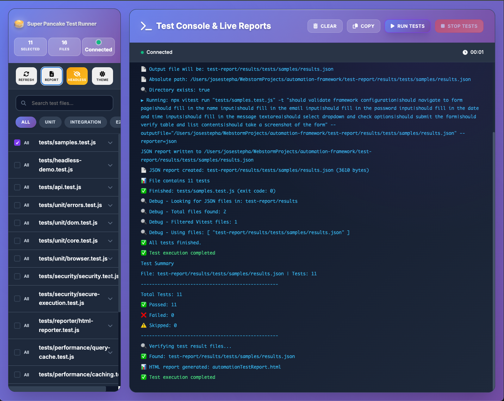
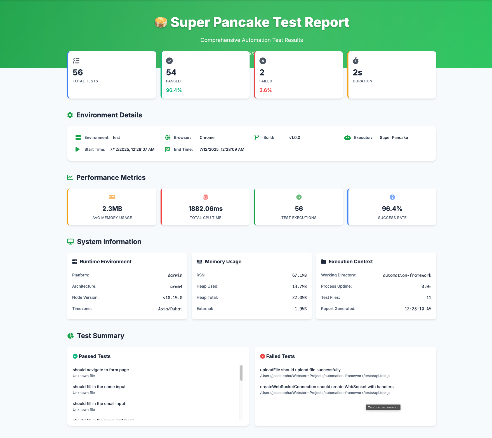

# 🥞 Super Pancake Automation

[](https://badge.fury.io/js/super-pancake-automation)
[](https://opensource.org/licenses/MIT)
[](https://nodejs.org/)
[](https://chromedevtools.github.io/devtools-protocol/)

A **lightweight DOM-based UI automation framework** using Chrome DevTools Protocol (CDP). Super Pancake provides a simple, powerful API for browser automation, testing, and reporting with a beautiful web UI.

## 🚀 Quick Start

### Create New Project
```bash
npm init super-pancake@latest my-project
cd my-project
npm install
npm test
```

This creates a complete project with:
- Interactive configuration setup
- Sample test files
- Package.json with all scripts
- Super Pancake config file
- Video recording options (always/retain-on-failure/off)

### Add to Existing Project
```bash
npm install super-pancake-automation
```

## 📱 Interactive Test Runner UI

Launch the beautiful web interface to run tests visually:

```bash
npx super-pancake-ui
```



### UI Features:
- ✅ **Test Selection**: Choose which tests to run
- 📊 **Real-time Logs**: Watch test execution live
- 🎯 **Individual Test Control**: Run specific test cases
- 🔄 **Auto-refresh**: Automatic test discovery
- 📱 **Responsive Design**: Works on desktop and mobile

## 📊 Beautiful HTML Reports

After running tests, view comprehensive reports:

```bash
# Reports are auto-generated after test runs
open automationTestReport.html
```



### Report Features:
- 📈 **Test Statistics**: Pass/fail/skipped counts with charts
- 📸 **Screenshots**: Automatic capture on failures
- 🕐 **Timestamps**: Detailed timing information
- 📝 **Error Details**: Stack traces and error messages
- 🎨 **Professional Design**: Clean, modern interface

## 🛠️ Installation & Setup

### Global Installation
```bash
npm install -g super-pancake-automation
```

### Project Installation
```bash
npm install super-pancake-automation --save-dev
```

### Generate Sample Tests
```bash
npx super-pancake-generate
```

## 🎯 Available Commands

### Project Setup
```bash
npm init super-pancake@latest my-project    # Create new project
npx super-pancake --version                # Check version
npx super-pancake --help                   # Show help
```

### Command Reference
| Command | Description | Example |
|---------|-------------|---------|
| `super-pancake-ui` | Launch interactive test runner | `npx super-pancake-ui` |
| `super-pancake-server` | Start UI server only | `npx super-pancake-server` |
| `super-pancake-run` | Run tests with formatted output | `npx super-pancake-run` |
| `super-pancake-generate` | Generate sample test files | `npx super-pancake-generate` |
| `super-pancake` | Main CLI with help/version | `npx super-pancake --version` |
| `domtest` | Basic CLI test runner (legacy) | `npx domtest --url=https://example.com` |

## 💻 Code Examples

### Basic Test Structure
```javascript

import { describe, it, beforeAll, afterAll } from 'vitest';
import { launchChrome } from 'super-pancake-automation/utils/launcher.js';
import { connectToChrome } from 'super-pancake-automation/core/browser.js';
import { createSession } from 'super-pancake-automation/core/session.js';
import {
  enableDOM,
  navigateTo,
  fillInput,
  check,
  selectOption,
  click,
  getAttribute,
  getText,
  waitForSelector,
  takeElementScreenshot
} from 'super-pancake-automation/core/dom.js';
import {
  assertEqual,
  assertContainsText,
} from 'super-pancake-automation/core/assert.js';
import { addTestResult, writeReport } from 'super-pancake-automation/reporter/htmlReporter.js';
import { testWithReport } from 'super-pancake-automation/helpers/testWrapper.js';
import { config } from 'super-pancake-automation/config.js';

let chrome, ws, session;

describe('Playground UI Form Test', () => {
  beforeAll(async () => {
    console.log('\n🔷 Playground UI Test Started');
    chrome = await launchChrome({ headed: true });
    ws = await connectToChrome();
    session = createSession(ws);
    await enableDOM(session);
  }, 30000); // 30 second timeout for Chrome startup

  afterAll(async () => {
    if (ws) ws.close();
    if (chrome) await chrome.kill();
    writeReport();
    console.log('\n🧹 Test complete. Chrome closed.');
  });

  it('should navigate to form page', { timeout: config.timeouts.testTimeout }, async () => {
    await testWithReport('should navigate to form page', async () => {
      await navigateTo(session, 'http://localhost:8080/form.html');
    }, session, import.meta.url);
  });

  it('should fill in the name input', { timeout: config.timeouts.testTimeout }, async () => {
    await testWithReport('should fill in the name input', async () => {
      await fillInput(session, 'input[name="name"]', 'Pradap');
    }, session, import.meta.url);
  });

  it('should fill in the email input', { timeout: config.timeouts.testTimeout }, async () => {
    await testWithReport('should fill in the email input', async () => {
      await fillInput(session, 'input[name="email"]', 'pradap@example.com');
    }, session, import.meta.url);
  });

  it('should fill in the password input', { timeout: config.timeouts.testTimeout }, async () => {
    await testWithReport('should fill in the password input', async () => {
      await fillInput(session, 'input[name="password"]', 'supersecret');
    }, session, import.meta.url);
  });

  it('should fill in the date and time inputs', { timeout: config.timeouts.testTimeout }, async () => {
    await testWithReport('should fill in the date and time inputs', async () => {
      await fillInput(session, 'input[name="date"]', '2025-06-23');
      await fillInput(session, 'input[name="time"]', '12:34');
    }, session, import.meta.url);
  });

  it('should fill in the message textarea', { timeout: config.timeouts.testTimeout }, async () => {
    await testWithReport('should fill in the message textarea', async () => {
      await fillInput(session, 'textarea[name="message"]', 'Test message');
    }, session, import.meta.url);
  });

  it('should select dropdown and check options', { timeout: config.timeouts.testTimeout }, async () => {
    await testWithReport('should select dropdown and check options', async () => {
      await selectOption(session, 'select[name="dropdown"]', 'two');
      await check(session, 'input[name="subscribe"]', true);
      await check(session, 'input[value="male"]', true);
    }, session, import.meta.url);
  });

  it('should submit the form', { timeout: config.timeouts.testTimeout }, async () => {
    await testWithReport('should submit the form', async () => {
      await click(session, 'button[type="submit"]');
    }, session, import.meta.url);
  });

  it('should submit the form', { timeout: config.timeouts.testTimeout }, async () => {
    await testWithReport('should submit the form', async () => {
      await click(session, 'button[type="submit"]');
    }, session, import.meta.url);
  });


  it('should verify table and list contents', { timeout: config.timeouts.testTimeout }, async () => {
    await testWithReport('should verify table and list contents', async () => {
      const status = await getAttribute(session, 'form', 'data-status');
      assertEqual(status, 'submitted', 'Form should be marked as submitted');

      const tableText = await getText(session, await waitForSelector(session, 'table'));
      assertContainsText(tableText, 'Alice', 'Table should include "Alice"');
      assertContainsText(tableText, 'Bob', 'Table should include "Bob"');

      const listText = await getText(session, await waitForSelector(session, 'ul'));
      assertContainsText(listText, 'Unordered Item 2');
    }, session, import.meta.url);
  });

});
```

### Advanced Form Testing
```javascript
import { 
  fillInput, 
  selectOption, 
  check, 
  submitForm,
  getFormData,
  isChecked,
  getSelectedOptions
} from 'super-pancake-automation/core/dom.js';

it('should handle complex form', async () => {
  await navigateTo(session, 'https://myapp.com/form');
  
  // Fill form fields
  await fillInput(session, '#name', 'John Doe');
  await fillInput(session, '#email', 'john@example.com');
  await selectOption(session, '#country', 'US');
  await check(session, '#newsletter', true);
  
  // Verify form state
  const isNewsletterChecked = await isChecked(session, '#newsletter');
  expect(isNewsletterChecked).toBe(true);
  
  // Get all form data
  const formData = await getFormData(session, '#contact-form');
  expect(formData.name).toBe('John Doe');
  
  // Submit form
  await submitForm(session, '#contact-form');
});
```

### Table Data Extraction
```javascript
import { 
  getTableData,
  getTableHeaders,
  getTableRow,
  getTableCell
} from 'super-pancake-automation/core/dom.js';

it('should extract table data', async () => {
  await navigateTo(session, 'https://myapp.com/users');
  
  // Get complete table data
  const tableData = await getTableData(session, '#users-table');
  console.log('Table data:', tableData);
  
  // Get headers
  const headers = await getTableHeaders(session, '#users-table');
  expect(headers).toContain('Name');
  
  // Get specific row
  const firstRow = await getTableRow(session, '#users-table', 0);
  expect(firstRow[0]).toBe('John Doe');
  
  // Get specific cell
  const cell = await getTableCell(session, '#users-table', 0, 1);
  expect(cell).toBe('john@example.com');
});
```

## 📚 Documentation

Comprehensive guides and resources:

| Document | Description |
|----------|-------------|
| **[Configuration Guide](docs/CONFIGURATION.md)** | Complete configuration system with environment profiles |
| **[Project Roadmap](docs/ROADMAP.md)** | Development roadmap and feature timeline |
| **[Architecture Guide](docs/ARCHITECTURE.md)** | Framework architecture and component overview |
| **[Project Status](docs/PROJECT_STATUS.md)** | Current status, metrics, and progress tracking |
| **[Feature Voting](docs/FEATURE_VOTING.md)** | Community feature requests and voting |
| **[Development Notes](docs/INFO)** | Internal development notes and context |

## 🔧 Configuration

The framework provides a comprehensive, environment-aware configuration system. See the **[Configuration Guide](docs/CONFIGURATION.md)** for complete details.

### Quick Configuration Example
```javascript
import { config, getConfig, isDevelopment } from './config.js';

// Environment-aware configuration
if (isDevelopment()) {
  // Headless disabled, DevTools open, debug logging
} else {
  // Production optimizations enabled
}

// Get specific config values
const headless = getConfig('browser.headless');
const timeout = getConfig('timeouts.testTimeout');
```

### Environment Profiles
- **Development**: Browser visible, DevTools open, verbose logging
- **Testing**: Optimized for automated testing with monitoring
- **Production**: Minimal logging, strict security, performance optimized
- **CI/CD**: Single-process mode, conservative resources, JUnit reports

## 🎨 Features

### ✨ Core Features
- 🎯 **Chrome DevTools Protocol**: Direct browser control
- 📸 **Screenshot Capture**: Automatic on failures
- 🕐 **Smart Waits**: Built-in element waiting strategies
- 📊 **HTML Reports**: Beautiful test reports
- 🖥️ **Web UI**: Interactive test runner
- 🔄 **Real-time Logs**: Live test execution feedback

### 🧪 Testing Capabilities
- **Form Testing**: Input fields, dropdowns, checkboxes, radio buttons
- **Table Operations**: Data extraction, row/cell access
- **Advanced Interactions**: Drag & drop, file uploads, mouse events
- **Visual Testing**: Screenshots, element positioning, viewport checks
- **Wait Strategies**: Visibility, clickability, text content, attributes

### 📱 Advanced Methods
```javascript
// Enhanced wait strategies
await waitForElementToBeVisible(session, '#popup');
await waitForElementToBeClickable(session, '#submit-btn');
await waitForElementToContainText(session, '#status', 'Success');

// Advanced interactions
await doubleClick(session, '#file-icon');
await selectText(session, '#text-area', 0, 10);
await uploadMultipleFiles(session, '#file-input', ['file1.pdf', 'file2.jpg']);

// Element analysis
const classes = await getElementClasses(session, '#my-div');
const children = await getElementChildren(session, '#container');
const hasClass = await hasClass(session, '#button', 'active');

// Visual testing
const position = await getElementPosition(session, '#element');
const size = await getElementSize(session, '#element');
const inViewport = await isElementInViewport(session, '#element');
```

## 🏗️ Architecture

### Core Components

| Component | Description |
|-----------|-------------|
| **browser.js** | Chrome DevTools Protocol connection management |
| **session.js** | CDP session handling with message routing |
| **dom.js** | 60+ DOM manipulation and query methods |
| **assert.js** | Custom assertion library with descriptive errors |
| **htmlReporter.js** | HTML report generation with screenshots |

### CLI Tools

| Tool | Purpose |
|------|---------|
| **ui-runner.js** | Interactive web UI for test execution |
| **ui-server.js** | Static file server for UI |
| **super-pancake-run.js** | Command-line test runner |
| **generate-test.js** | Sample test file generator |

## 🚀 NPM Scripts

Add these scripts to your `package.json`:

```json
{
  "scripts": {
    "test": "vitest",
    "test:ui": "super-pancake-ui",
    "test:run": "super-pancake-run",
    "test:watch": "vitest --watch",
    "test:generate": "super-pancake-generate"
  }
}
```

## 📦 Package.json Configuration

```json
{
  "name": "super-pancake-automation",
  "version": "1.0.25",
  "description": "A lightweight DOM-based UI automation framework using Chrome DevTools Protocol",
  "keywords": [
    "automation", "ui-testing", "chrome-devtools", "browser-automation",
    "playwright-alternative", "puppeteer-alternative", "selenium-alternative"
  ],
  "engines": {
    "node": ">=16.0.0",
    "npm": ">=8.0.0"
  },
  "os": ["darwin", "linux", "win32"],
  "cpu": ["x64", "arm64"]
}
```

## 🔍 All Available Methods

### Navigation & Setup
- `enableDOM(session)` - Enable required CDP domains
- `navigateTo(session, url)` - Navigate to URL
- `reload(session)` - Reload page
- `goBack(session)` / `goForward(session)` - Browser navigation

### Element Queries
- `querySelector(session, selector)` - Find single element
- `querySelectorAll(session, selector)` - Find multiple elements
- `waitForSelector(session, selector, timeout)` - Wait for element
- `getElementsCount(session, selector)` - Count matching elements

### Basic Interactions
- `click(session, selector)` - Click element
- `doubleClick(session, selector)` - Double click
- `rightClick(session, selector)` - Right click
- `type(session, selector, text)` - Type text
- `clearInput(session, selector)` - Clear input
- `fillInput(session, selector, value)` - Fill input with events

### Advanced Interactions
- `dragDrop(session, sourceSelector, targetSelector)` - Drag and drop
- `uploadFileBuffer(session, selector, filename, content)` - File upload
- `uploadMultipleFiles(session, selector, filePaths)` - Multiple file upload
- `selectText(session, selector, startOffset, endOffset)` - Text selection
- `mouseDown(session, selector)` / `mouseUp(session, selector)` - Mouse events

### Form Handling
- `check(session, selector, checked)` - Checkbox/radio control
- `selectOption(session, selector, values)` - Dropdown selection
- `selectMultipleOptions(session, selector, values)` - Multi-select
- `submitForm(session, formSelector)` - Submit form
- `resetForm(session, formSelector)` - Reset form
- `getFormData(session, formSelector)` - Extract form data
- `isChecked(session, selector)` - Check checkbox state
- `getSelectedOptions(session, selector)` - Get selected options

### Element State & Properties
- `getText(session, nodeId)` - Get element text
- `getAttribute(session, selector, attrName)` - Get attribute
- `setValue(session, selector, value)` - Set value
- `isVisible(session, selector)` - Check visibility
- `isEnabled(session, selector)` - Check enabled state
- `getElementTagName(session, selector)` - Get tag name
- `getElementClasses(session, selector)` - Get CSS classes
- `hasClass(session, selector, className)` - Check for class

### Wait Strategies
- `waitForElementToBeVisible(session, selector, timeout)` - Wait for visibility
- `waitForElementToBeClickable(session, selector, timeout)` - Wait for clickability
- `waitForElementToContainText(session, selector, text, timeout)` - Wait for text
- `waitForElementToHaveAttribute(session, selector, attribute, value, timeout)` - Wait for attribute
- `waitForElementToBeEnabled(session, selector, timeout)` - Wait for enabled state
- `waitForCondition(session, conditionFn, timeout)` - Custom condition waiter

### Data Extraction
- `getTableData(session, tableSelector)` - Complete table data
- `getTableHeaders(session, tableSelector)` - Table headers
- `getTableRow(session, tableSelector, rowIndex)` - Specific row
- `getTableCell(session, tableSelector, rowIndex, columnIndex)` - Specific cell
- `getListItems(session, listSelector)` - List items with metadata
- `getListItemByIndex(session, listSelector, index)` - Specific list item

### Visual Testing
- `takeScreenshot(session, fileName)` - Full page screenshot
- `takeElementScreenshot(session, selector, fileName)` - Element screenshot
- `getElementPosition(session, selector)` - Element coordinates
- `getElementSize(session, selector)` - Element dimensions
- `getElementBounds(session, selector)` - Complete bounding box
- `isElementInViewport(session, selector)` - Viewport check
- `scrollToElement(session, selector)` - Scroll to element
- `scrollToTop(session)` / `scrollToBottom(session)` - Page scrolling
- `getScrollPosition(session)` - Current scroll position

### Element Analysis
- `getElementChildren(session, selector)` - Child elements
- `getElementParent(session, selector)` - Parent element
- `focus(session, selector)` - Focus element
- `hover(session, selector)` - Hover over element

## 🧪 Testing Examples

### Screenshot Testing
```javascript
// Take full page screenshot
await takeScreenshot(session, 'full-page.png');

// Take element screenshot
await takeElementScreenshot(session, '#chart', 'chart-screenshot.png');

// Visual regression testing
const bounds = await getElementBounds(session, '#header');
expect(bounds.height).toBe(60);
```

### Advanced Form Testing
```javascript
// Multi-step form with validation
await fillInput(session, '#step1-name', 'John Doe');
await click(session, '#next-step');
await waitForElementToBeVisible(session, '#step2');

await selectMultipleOptions(session, '#skills', ['javascript', 'python']);
await uploadMultipleFiles(session, '#documents', ['resume.pdf', 'cover.doc']);

const formData = await getFormData(session, '#application-form');
expect(formData.name).toBe('John Doe');
expect(formData.skills).toEqual(['javascript', 'python']);
```

## 📊 CI/CD Integration

### GitHub Actions
```yaml
name: Test Suite
on: [push, pull_request]
jobs:
  test:
    runs-on: ubuntu-latest
    steps:
      - uses: actions/checkout@v4
      - uses: actions/setup-node@v4
        with:
          node-version: '18'
      - run: npm ci
      - run: npm test
      - uses: actions/upload-artifact@v3
        with:
          name: test-reports
          path: automationTestReport.html
```

## 🤝 Contributing

1. Fork the repository
2. Create your feature branch (`git checkout -b feature/amazing-feature`)
3. Commit your changes (`git commit -m 'Add amazing feature'`)
4. Push to the branch (`git push origin feature/amazing-feature`)
5. Open a Pull Request


## 🐛 Issues & Support

- **Bug Reports**: [GitHub Issues](https://github.com/pradapjackie/super-pancake/issues)
- **Feature Requests**: [GitHub Issues](https://github.com/pradapjackie/super-pancake/issues)
- **Email Support**: pradapjackie@gmail.com

## 📄 License

MIT License © 2025 Pradap Pandiyan

## 🔗 Links

- **NPM Package**: [super-pancake-automation](https://www.npmjs.com/package/super-pancake-automation)
- **GitHub Repository**: [super-pancake](https://github.com/pradapjackie/super-pancake)
- **Documentation**: [GitHub Wiki](https://github.com/pradapjackie/super-pancake/wiki)

---

### 🌟 Star us on GitHub if Super Pancake helps you! 

[](https://github.com/pradapjackie/super-pancake)
