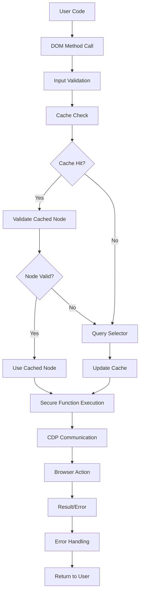
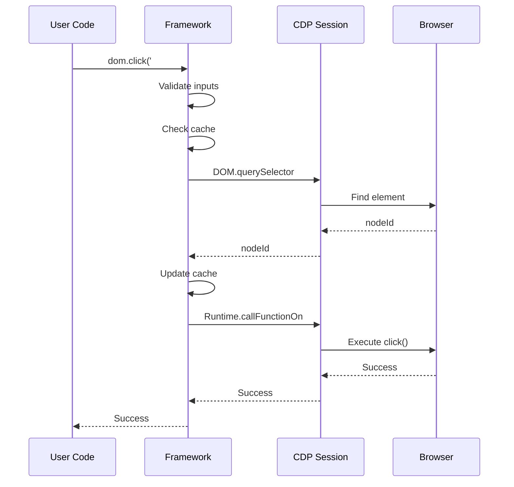
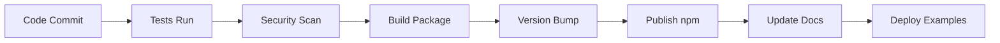

# 🏗️ Technical Architecture

## Overview

Super Pancake Automation Framework is built on a **modular, secure, and performance-first architecture** using modern JavaScript and Chrome DevTools Protocol.

---

## 🔧 Current Architecture (v2.10.0)

### 📊 **High-Level Architecture**

```
┌─────────────────────────────────────────────────────────────┐
│                    User Applications                         │
├─────────────────────────────────────────────────────────────┤
│                  Public API Layer                           │
│  ┌─────────────┬─────────────┬─────────────┬─────────────┐  │
│  │    DOM      │     API     │  Browser    │  Utilities  │  │
│  │  Methods    │   Testing   │  Control    │   & Helpers │  │
│  └─────────────┴─────────────┴─────────────┴─────────────┘  │
├─────────────────────────────────────────────────────────────┤
│                   Core Framework                            │
│  ┌─────────────┬─────────────┬─────────────┬─────────────┐  │
│  │  Security   │    Cache    │   Error     │  Session    │  │
│  │ Framework   │   System    │  Handling   │ Management  │  │
│  └─────────────┴─────────────┴─────────────┴─────────────┘  │
├─────────────────────────────────────────────────────────────┤
│                 Chrome DevTools Protocol                    │
│  ┌─────────────┬─────────────┬─────────────┬─────────────┐  │
│  │    DOM      │   Runtime   │   Network   │    Page     │  │
│  │   Domain    │   Domain    │   Domain    │   Domain    │  │
│  └─────────────┴─────────────┴─────────────┴─────────────┘  │
├─────────────────────────────────────────────────────────────┤
│                   Chrome Browser                            │
└─────────────────────────────────────────────────────────────┘
```

### 🗂️ **Module Structure**

```
super-pancake-automation/
├── core/                    # Core framework modules
│   ├── browser.js          # Browser lifecycle management
│   ├── session.js          # CDP session handling
│   ├── dom.js             # DOM manipulation methods
│   ├── api.js             # API testing utilities
│   ├── errors.js          # Error handling system
│   ├── secure-execution.js # Security framework
│   └── query-cache.js     # Performance caching
├── utils/                  # Utility modules
│   ├── launcher.js        # Browser launcher
│   └── env.js            # Environment management
├── scripts/               # Executable scripts
│   └── test-ui.js        # Web UI server
├── bin/                   # CLI executables
├── public/               # Web UI assets
├── reporter/             # Reporting modules
├── helpers/              # Test helpers
└── tests/               # Test suites
```

---

## 🔒 Security Architecture

### 🛡️ **Security Layers**

1. **Input Validation Layer**
   - Parameter sanitization
   - Type checking
   - Range validation
   - Malicious content detection

2. **Secure Execution Layer**
   - Parameterized function calls
   - Predefined function library
   - No string interpolation in CDP calls
   - Safe error propagation

3. **Session Isolation Layer**
   - Session-specific caching
   - Resource cleanup
   - Memory leak prevention

### 🔐 **Security Principles**

```javascript
// ❌ Vulnerable (old approach)
await session.send('Runtime.callFunctionOn', {
  functionDeclaration: `function() { this.value = '${userInput}'; }`
});

// ✅ Secure (current approach)
await executeSecureFunction(session, nodeId, 'setValue', [userInput]);
```

---

## ⚡ Performance Architecture

### 🏃‍♂️ **Performance Optimizations**

1. **Query Caching System**
   - LRU cache with TTL
   - Automatic invalidation
   - Session isolation
   - Memory management

2. **Lazy Loading**
   - Module loading on demand
   - Resource cleanup
   - Connection pooling

3. **Efficient Communication**
   - Batched CDP operations
   - Minimal data transfer
   - Optimized JSON parsing

### 📊 **Cache Architecture**

```
┌─────────────────────────────────────────┐
│              Query Cache                │
├─────────────────────────────────────────┤
│  Key: session_id + selector            │
│  Value: { nodeId, timestamp }          │
│  TTL: 30 seconds (configurable)        │
│  Max Size: 100 entries (configurable)  │
│  Eviction: LRU + TTL                   │
└─────────────────────────────────────────┘
```

---

## 🔄 Data Flow

### 📊 **Test Execution Flow**



### 🌊 **WebSocket Communication Flow**



---

## 🚀 Future Architecture (Roadmap)

### 🎯 **Planned Architectural Changes**

#### Phase 3: Developer Experience
```
┌─────────────────────────────────────────┐
│           Visual Test Builder           │
├─────────────────────────────────────────┤
│  ┌─────────────┬─────────────────────┐  │
│  │   Drag &    │     Code           │  │
│  │   Drop UI   │   Generation       │  │
│  └─────────────┴─────────────────────┘  │
└─────────────────────────────────────────┘
```

#### Phase 4: Enterprise Features
```
┌─────────────────────────────────────────┐
│         Parallel Execution              │
├─────────────────────────────────────────┤
│  ┌─────────┬─────────┬─────────────────┐ │
│  │ Worker  │ Worker  │    Resource     │ │
│  │ Pool 1  │ Pool 2  │   Manager       │ │
│  └─────────┴─────────┴─────────────────┘ │
└─────────────────────────────────────────┘
```

#### Phase 5: Plugin Architecture
```
┌─────────────────────────────────────────┐
│             Plugin System               │
├─────────────────────────────────────────┤
│  ┌─────────┬─────────┬─────────────────┐ │
│  │  Core   │ Plugin  │    Marketplace  │ │
│  │  APIs   │  SDK    │    & Registry   │ │
│  └─────────┴─────────┴─────────────────┘ │
└─────────────────────────────────────────┘
```

---

## 🔧 Technology Stack

### 📚 **Current Stack**

| Layer | Technology | Version | Purpose |
|-------|------------|---------|---------|
| **Runtime** | Node.js | 16+ | JavaScript execution |
| **Language** | ES Modules | ES2022 | Modern JavaScript |
| **Browser** | Chrome/Chromium | 90+ | Test execution |
| **Protocol** | Chrome DevTools | Latest | Browser communication |
| **Testing** | Vitest | 3.x | Unit testing |
| **Web UI** | Express.js | 5.x | Test runner UI |
| **WebSocket** | ws | 8.x | Real-time communication |

### 🔮 **Future Stack Additions**

| Component | Technology | Timeline | Purpose |
|-----------|------------|----------|---------|
| **AI/ML** | TensorFlow.js | Phase 3 | Test generation |
| **Multi-Browser** | WebDriver BiDi | Phase 4 | Cross-browser support |
| **Mobile** | Appium | Phase 5 | Mobile testing |
| **Cloud** | Kubernetes | Phase 6 | Scalable execution |

---

## 📏 Design Principles

### 🎯 **Core Principles**

1. **Security First**
   - All inputs validated
   - No code injection possible
   - Secure by default

2. **Performance Optimized**
   - Minimal overhead
   - Smart caching
   - Efficient resource usage

3. **Developer Friendly**
   - Simple, intuitive API
   - Great error messages
   - Comprehensive documentation

4. **Modular Design**
   - Loosely coupled components
   - Easy to extend
   - Plugin-ready architecture

5. **Backward Compatible**
   - Stable public API
   - Graceful deprecation
   - Migration guides

### 🏗️ **SOLID Principles Application**

- **Single Responsibility**: Each module has one clear purpose
- **Open/Closed**: Extensible via plugins, closed for modification
- **Liskov Substitution**: Session implementations are interchangeable
- **Interface Segregation**: Small, focused APIs
- **Dependency Inversion**: High-level modules don't depend on low-level details

---

## 🧪 Testing Architecture

### 📊 **Test Pyramid**

```
        ┌─────────────────┐
        │  E2E Tests      │  ← Integration tests
        │                 │
    ┌───┴─────────────────┴───┐
    │   Integration Tests     │  ← API + Security tests
    │                         │
┌───┴─────────────────────────┴───┐
│        Unit Tests               │  ← Core logic tests
│                                 │
└─────────────────────────────────┘
```

### 🎯 **Test Categories**

1. **Unit Tests** (85% coverage target)
   - Individual function testing
   - Mock external dependencies
   - Fast execution (<1s)

2. **Integration Tests** (Key workflows)
   - Multi-module interactions
   - Security validation
   - Performance verification

3. **E2E Tests** (Critical paths)
   - Full framework workflows
   - Real browser testing
   - User scenario validation

---

## 📊 Monitoring & Observability

### 📈 **Metrics Collection**

```javascript
// Performance Metrics
{
  "queryTime": 15,          // ms
  "cacheHitRate": 0.85,     // %
  "memoryUsage": 45,        // MB
  "testDuration": 2500,     // ms
  "errorRate": 0.02         // %
}

// Usage Metrics
{
  "methodCalls": {
    "click": 1250,
    "type": 890,
    "waitForSelector": 445
  },
  "browserSessions": 23,
  "testsRun": 156
}
```

### 🔍 **Error Tracking**

```javascript
// Structured Error Context
{
  "error": "ElementNotFoundError",
  "selector": "#submit-button",
  "context": {
    "url": "https://example.com",
    "viewport": "1920x1080",
    "retries": 3
  },
  "timestamp": "2025-01-12T10:30:00Z"
}
```

---

## 🔄 Deployment Architecture

### 📦 **Distribution Strategy**

1. **npm Package**
   - Core framework distribution
   - Semantic versioning
   - Automated publishing

2. **Docker Images**
   - Pre-configured environments
   - CI/CD integration
   - Multi-architecture support

3. **Cloud Platform** (Future)
   - Managed service
   - Scalable execution
   - Team collaboration

### 🚀 **Release Pipeline**



---

## 🔗 Integration Points

### 🌐 **External System Integration**

| System Type | Current | Planned | Integration Method |
|-------------|---------|---------|-------------------|
| **CI/CD** | Manual | GitHub Actions | Workflow templates |
| **IDE** | Basic | VSCode Extension | Language Server |
| **Monitoring** | Logs | APM Tools | OpenTelemetry |
| **Cloud** | None | AWS/GCP/Azure | Container deployment |

---

*This architecture document is updated with each major release. Last updated: January 2025*